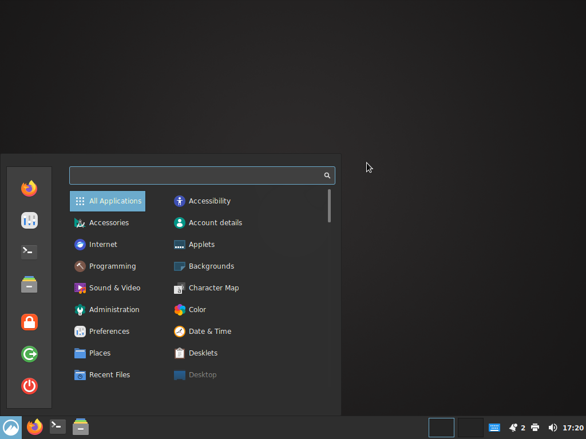
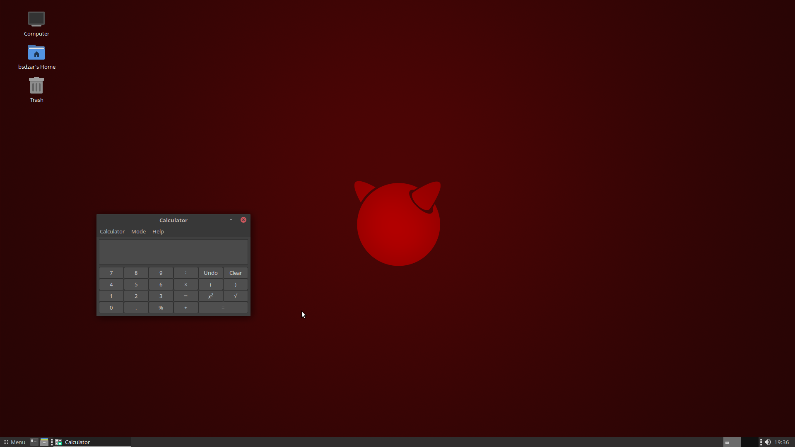

# FreeBSDesktop
Desktop install script system for FreeBSD

## About
This script will transform a standard installation of FreeBSD into a desktop system by bootstrapping PKG, adding Xorg, a desktop environment with theming, some optional desktop software, a login manager, and set up users.

## Usage
1. Install a minimal image of FreeBSD in *Bios/MBR* mode (not UEFI), select *with sources* if you plan on using nVidia drivers, and *do not* create any additional users.
2. Boot your new FreeBSD system and log in as *root*.
3. Navigate to yout */tmp* directory, fetch the release archive, and run it:
```
$ cd /tmp
$ fetch https://trisymphony.com/fbsdesk
$ tar zxf fbsdesk
$ sh main.sh
```
4. Follow the instructions on screen. If you made a mistake, use CTRL+C to abort, then simply run the script again.

### Installation tutorials on YouTube
You can find a step-by-step guide on YouTube which covers creating a FreeBSD installation image, installing the OS, and installing FreeBSDesktop: #TODO

You can find the old tutorial for DarkMate 13 here: https://youtu.be/1jIoSwwz2ak

## Keyboard Shortcuts
- SUPER+left, SUPER+right: tile windows left/right
- SUPER+up: maximize window
- SUPER+down: minimize window
- SUPER+e: launch file manager
- SUPER+t: launch terminal
- SUPER+b: launch browser

## Wallpapers and icons
Custom wallpapers and icons are located at
- /usr/local/share/backgrounds/fbsdesktop
- /usr/local/share/icons/fbsdesktop

## Screenshots
### Cinnamon

### Mate



## Keyboard codes without dialog
If you do not use the new dialog UI, the script will ask you to define your keyboard layout. If you go with the defaults, you will be getting the standard US layout. A full list of language and variant codes can be found here: https://unix.stackexchange.com/questions/43976/list-all-valid-kbd-layouts-variants-and-toggle-options-to-use-with-setxkbmap

The layout can be changed later at any point. 
- For MATE, simply navigate to the Keyboard Settings. 
- For SLiM, edit the file */etc/X11/xorg.conf.d/10-keyboard.conf*

## Untested
- My hardware selection is limited. Only current nVidia drivers and AMDGPU are tested. If you have older hardware and/or intel graphics, please let me know if/how it works.

## Differences to previous version
- renamed to FreeBSDesktop
- built and distributed as self-contained package - but *makeself* is bugged, better use TAR
- redesigned file structure (no more 1 single monster script)
- supports multiple desktop environments (Mate and Cinnamon for now)
- dialog-only, no more pure CLI override
- nvidia 470 added
- new cinnamon desktop
- new icons
- new CLI app selection (FAMP and Emacs for now)

## Release log
- 2023-03-10: completely refactured, modular design; Cinnamon; CLI apps; distribution scripts
- 2021-04-22: options for SLiM and LightDM, fix for user name (pw add -c)
- 2021-03-10: bug fixes, Mint-Y dark themes, new features: keyboard layout/variant selection, dialog, amd, intel, switch to FreeBSD 13.0-rc1
- 2020-05-02: refactoring, printf, new feature: tmpfs directory
- 2020-03-27: DarkMate 12.1 release, switch to FreeBSD 12.1
- 2019-03-29: first DarkMate release, switch to FreeBSD 12
- 2018-01-11: added -x -u parameters, fixes for KDE/VLC, new network check, Xorg installed by default, echo -y removed, added freebsd-update
- 2018-01-02: Initial release for FreeBSD 10/11

## Credits
- dialog by Thomas E. Dickey https://invisible-island.net/dialog/
- icon theme is PAPIRUS https://github.com/PapirusDevelopmentTeam/papirus-icon-theme
- desktop theming guide by olivierd https://forums.freebsd.org/threads/gschema-override-not-holding.69973/#post-422183
- Arc Grey Theme avaialble on https://github.com/pinpox/arc-grey-theme, retrieved from https://www.gnome-look.org/p/1135255/
