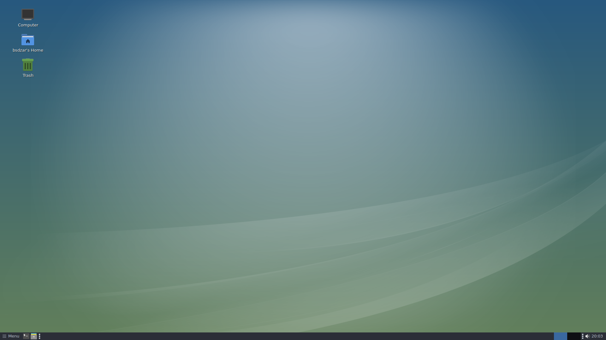
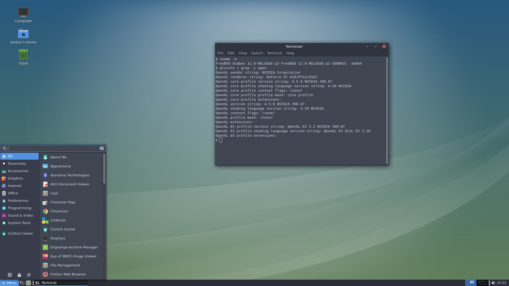
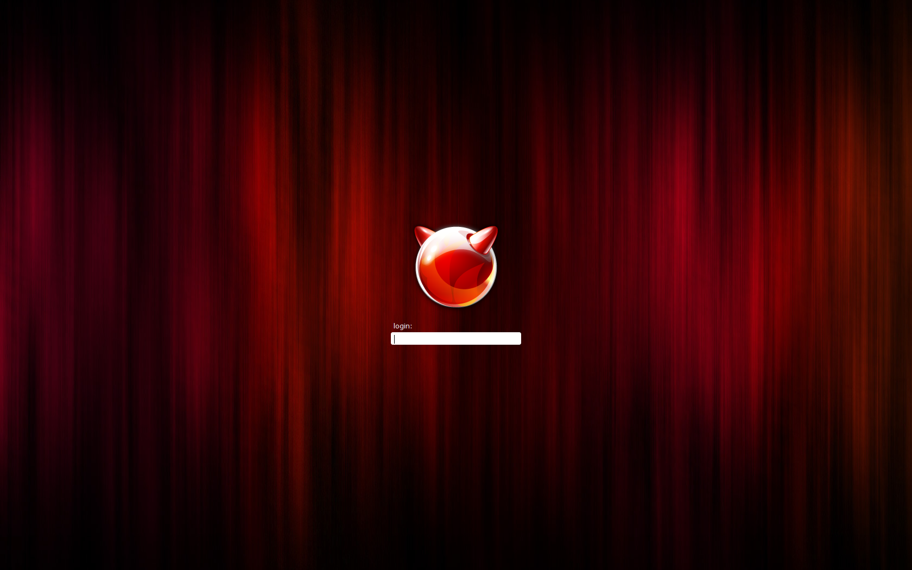

# DarkMate 12
desktop install script for FreeBSD 12

## About
This script helps you set up a desktop system on top of FreeBSD 12. It will install PKG, X, MATE, SLiM, some optional Desktop software and set up a 'wheel/video' user.

## Usage
1. Install a minimal image of FreeBSD 12, but do not create any additional users.
2. Boot your new FreeBSD system and log in as root.
3. Navigate to yout TMP directory, fetch the install script from GitHub, and run it:
```
$ cd /tmp
$ fetch --no-verify-peer https://raw.githubusercontent.com/broozar/installDesktopFreeBSD/DarkMate12/install.sh
$ chmod +x install.sh
$ ./install.sh
```
4. Follow the instructions on screen. If you made a mistake, use CTRL+C to abort, then simply run the script again.

## Advanced options
You can launch the script with additional parmeters:

-x skips the Xorg installation<br />
-u forces freebsd-update

## Keyboard codes
The script will ask you to define your keyboard layout. If you go with the defaults, you will be getting the standard US layout. A full list of language and variant codes can be found here: https://unix.stackexchange.com/questions/43976/list-all-valid-kbd-layouts-variants-and-toggle-options-to-use-with-setxkbmap

The layout can be changed later at any point. For MATE, simply navigate to the Keyboard Settings. For SLiM, edit the file **/etc/X11/xorg.conf.d/10-keyboard.conf**

## Known issues
- No graphics driver installation, this has to be done manually.
- SLiM Theme is designed for 1080p. If you have a smaller resolution or run in a VM, the login screen might not be centered, but is still usable.
- Keyboard layouts and variants are not checked for validity.

## Differences to previous versions
Unlike the old installDesktop.sh, DarkMate will not give you any choice in the Desktop Environment you are going to install, and rather focus on giving you a single, streamlined desktop experience using MATE and custom theming.

The -u startup parameter now forces freebsd-update rather than disabling it.

## Screenshots

Clean desktop:


Brisk menu and Mate-Terminal:


SLiM theme:


## Credits
- icon theme is PAPIRUS https://github.com/PapirusDevelopmentTeam/papirus-icon-theme
- SLIM theme by ross http://daemon-notes.com/articles/desktop/slim
- desktop theming tips by olivierd https://forums.freebsd.org/threads/gschema-override-not-holding.69973/#post-422183

## YouTube tutorial (click image to play)

[](https://youtu.be/vMzE63z6yLk)

## Changelog
- 2019-03-29: first DarkMate release, switch to FreeBSD 12
- 2018-01-11: added -x -u parameters, fixes for KDE/VLC, new network check, Xorg installed by default, echo -y removed, added freebsd-update<br />
- 2018-01-02: Initial release for FreeBSD 10/11
