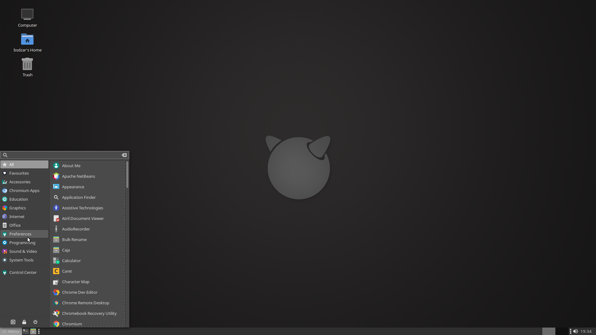

# DarkMate 12.1
desktop install script for FreeBSD 12.1

## About
This script helps you set up a desktop system on top of FreeBSD 12.1. It will install PKG, X, MATE, SLiM, some additional tools and set up a 'wheel video' user.

## Usage
1. Install a minimal image of FreeBSD 12.1 *with sources*, but do not create any additional users.
2. Boot your new FreeBSD system and log in as root.
3. Navigate to yout TMP directory, fetch the install script from GitHub, and run it:
```
$ cd /tmp
$ fetch --no-verify-peer http://trisymphony.com/darkMate -o install.sh
$ chmod +x install.sh
$ ./install.sh
```
4. Follow the instructions on screen. If you made a mistake, use CTRL+C to abort, then simply run the script again.

## Advanced options
You can launch the script with additional parmeters:

-x skips the Xorg installation<br />
-u forces freebsd-update

## Keyboard codes
The script will ask you to define your keyboard layout. If you go with the defaults, you will be getting the standard US layout. A full list of language and variant codes can be found here: https://unix.stackexchange.com/questions/43976/list-all-valid-kbd-layouts-variants-and-toggle-options-to-use-with-setxkbmap

The layout can be changed later at any point. For MATE, simply navigate to the Keyboard Settings. For SLiM, edit the file **/etc/X11/xorg.conf.d/10-keyboard.conf**

## Known issues
- No graphics driver installation, this has to be done manually. See video below.
- Keyboard layouts and variants are not checked for validity.

## Differences to previous version
- Version 12.1 cuts out all optional desktop software that was previously asked about in 12.0. To install software like GIMP, Blender or Audacity, please use pkg after you have rebooted the system.
- The script code has been cleaned up and should be easier to follow. 
- External data like config files, screenshots etc. has been moved to separate files which will be downloaded from GitHub as needed.

## Screenshots
### Grey theme


### Alternative red wallpaper


## Credits
- icon theme is PAPIRUS https://github.com/PapirusDevelopmentTeam/papirus-icon-theme
- desktop theming guide by olivierd https://forums.freebsd.org/threads/gschema-override-not-holding.69973/#post-422183

## YouTube tutorial (click image to play)

[](https://youtu.be/vMzE63z6yLk)

## Changelog
- 2020-03-27: DarkMate 12.1 release, switch to FreeBSD 12.1
- 2019-03-29: first DarkMate release, switch to FreeBSD 12
- 2018-01-11: added -x -u parameters, fixes for KDE/VLC, new network check, Xorg installed by default, echo -y removed, added freebsd-update<br />
- 2018-01-02: Initial release for FreeBSD 10/11
